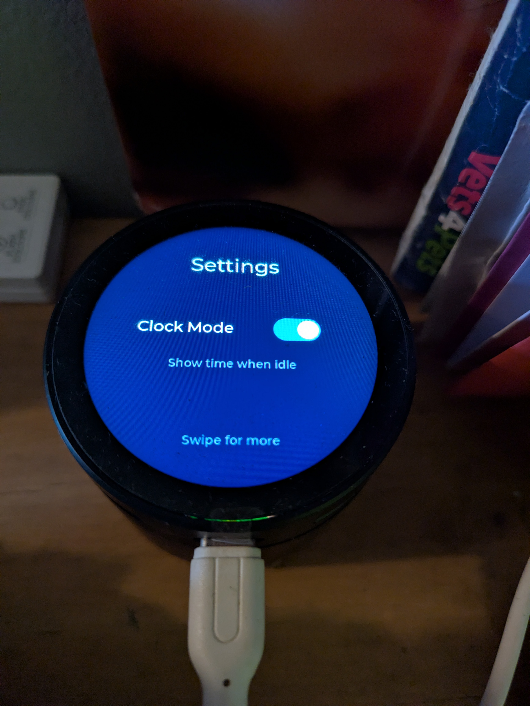
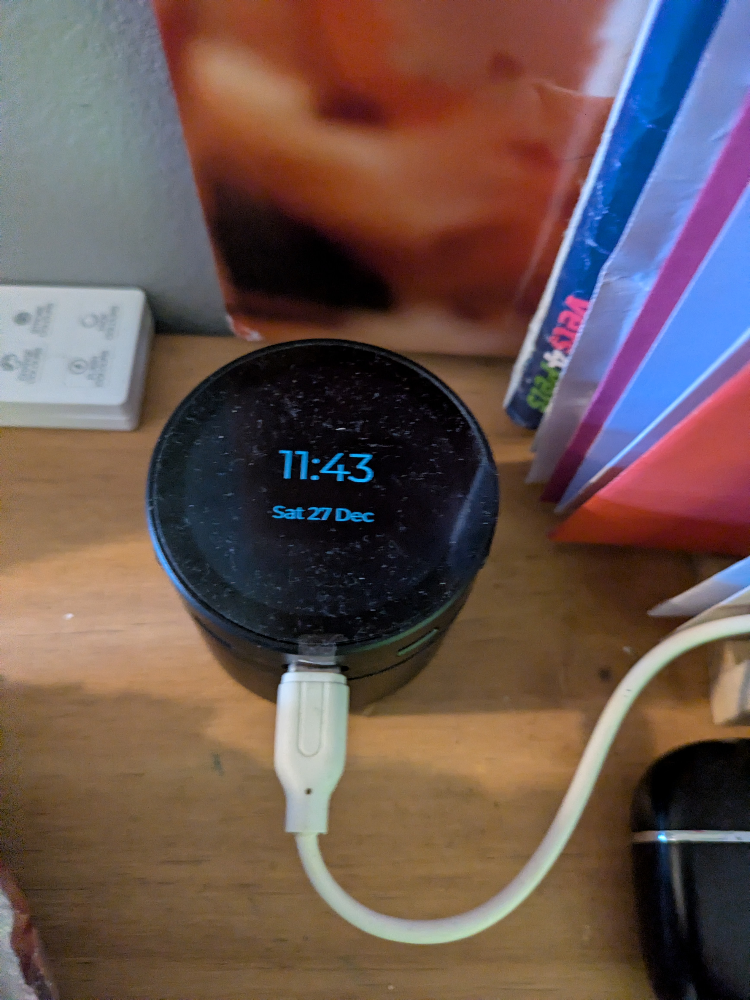

# Waveshare ESP32-S3-Touch-LCD-1.85C ESPHome Configuration

A complete ESPHome configuration for the **Waveshare ESP32-S3-Touch-LCD-1.85C** - a round 360×360 touchscreen display with voice assistant capabilities.

| Home Screen | Settings | Device Info |
|:-----------:|:--------:|:-----------:|
|  |  |  |

| Home (alt) | Listening | Listening (alt) |
|:----------:|:---------:|:----------:|
|  |  |  |

## 🛒 Hardware Used

| Component | Details | Link |
|-----------|---------|------|
| **Display Device** | Waveshare ESP32-S3-Touch-LCD-1.85C-BOX | [Amazon UK](https://amzn.eu/d/hUmyvZn) |
| **Home Assistant Server** | HP EliteDesk 800 G4 65W (16GB RAM, 256GB SSD) | Running Docker |

## ✨ Features

| Feature | Status | Notes |
|---------|--------|-------|
| **360×360 Round LVGL Display** | ✅ Working | Beautiful UI with multiple pages |
| **Capacitive Touchscreen** | ✅ Working | CST816 with swipe gestures |
| **Voice Assistant (Wake Word)** | ✅ Working | Say "Hey Jarvis" to activate |
| **Visual Voice Feedback** | ✅ Working | Spinning ring: 🟢 Listening, 🟠 Processing, 🔴 Error |
| **Weather Display** | ✅ Working | Temperature & conditions from HA |
| **Time & Date** | ✅ Working | Synced from Home Assistant |
| **Mute Toggle** | ✅ Working | Press side button to mute/unmute |
| **Speaker Output** | ✅ Working | TTS responses play through speaker |
| **Microphone Input** | ✅ Working | Captures voice commands |
| **Auto Sleep/Wake** | ✅ Working | Display dims after 30s, touch/voice to wake |
| **Clock Mode (Screensaver)** | ✅ Working | Always-on clock display when idle - use as a desk clock! |
| **Settings Page** | ✅ Working | On-device settings with touch toggles |
| **WiFi Connected** | ✅ Working | Full Home Assistant integration |
| **OTA Updates** | ✅ Working | Update firmware over-the-air |
| **Media Player** | ❌ Not Supported | Requires Arduino framework (ESP-IDF needed for display) |

## 📁 Project Structure

```
ESP32-S3-Touch-LCD-185/
├── waveshare-esp32-s3-lcd-185.yaml     # 🎯 MAIN PRODUCTION CONFIG
├── docker-compose.yaml                 # Full HA + Voice stack for Docker
├── test/
│   ├── test-display-only.yaml          # Simple LVGL test
│   └── test-waveshare-official.yaml    # Minimal display test
├── media/                              # Demo images and video
├── secret.example.yaml                 # Template for secrets (copy to secret.yaml)
├── README.md                           # This file
├── VOICE_ASSISTANT_SETUP.md            # Voice assistant setup guide
├── WAVESHARE_SETUP.md                  # General setup guide
└── ESP32-S3-TOUCH-LCD-185C-SOLUTION.md # Technical solution details
```

## 🚀 Quick Start

### Prerequisites

- [ESPHome](https://esphome.io/) installed (via Home Assistant Add-on or Docker container)
- USB-C cable
- Home Assistant with voice pipeline configured (see [VOICE_ASSISTANT_SETUP.md](VOICE_ASSISTANT_SETUP.md))

### Running with Docker Compose (Recommended)

If you're running Home Assistant in Docker (not HAOS/Supervised), use the included `docker-compose.yaml` which sets up:
- **Home Assistant** - with GPU passthrough for AMD
- **Whisper** - Speech-to-text (GPU accelerated)
- **Piper** - Text-to-speech
- **openWakeWord** - Wake word detection
- **ESPHome** - Device management

```bash
# Start all services
docker-compose up -d

# View logs
docker-compose logs -f
```

**Services:**
| Service | Port | Description |
|---------|------|-------------|
| Home Assistant | 8123 | Main HA interface |
| ESPHome | 6052 | ESPHome dashboard |
| Whisper | 10300 | Speech-to-text |
| Piper | 10200 | Text-to-speech |
| openWakeWord | 10400 | Wake word detection |

> **Note**: The docker-compose includes AMD GPU passthrough (`/dev/dri`, `/dev/kfd`). Remove these if not using AMD GPU.

### Step 1: Configure Secrets

```bash
cp secret.example.yaml secret.yaml
```

Edit `secret.yaml`:

```yaml
wifi_ssid: "YourWiFiNetwork"
wifi_password: "YourWiFiPassword"
api_encryption_key: "your-32-character-api-key-here!"
ota_password: "your-ota-password"
ap_password: "fallback-ap-password"
```

> **Tip**: Generate an API key with: `openssl rand -base64 32`

### Step 2: Flash the Device

#### First Flash (USB) - Using ESPHome Web

1. **Build the firmware** in ESPHome Dashboard (`http://your-server-ip:6052`)
   - Click on the device → **Install** → **Manual Download** → **Factory Format**
   - Save the `.factory.bin` file

2. **Flash via USB** using [ESPHome Web](https://web.esphome.io/)
   - Connect device via USB-C
   - Go to https://web.esphome.io/
   - Click **Connect** → Select your device
   - Click **Install** → Choose the `.factory.bin` file

> **Linux USB Permissions**: If the device isn't detected, run:
> ```bash
> sudo chmod 666 /dev/ttyACM0  # or /dev/ttyUSB0
> ```

#### Subsequent Updates (OTA)

Once the device is connected to WiFi, update over-the-air:

1. Open ESPHome Dashboard (`http://your-server-ip:6052`)
2. Click on the device → **Visit** (opens device web interface)
3. Click **OTA Update** → Upload the `.ota.bin` file

Or use the dashboard directly:
- Click device → **Install** → **Wirelessly**

### Step 3: Configure Voice Assistant in Home Assistant

See [VOICE_ASSISTANT_SETUP.md](VOICE_ASSISTANT_SETUP.md) for detailed instructions.

### Step 4: Set Up Weather Display

Create an automation in Home Assistant to send weather data to the display:

1. Go to **Settings → Automations & Scenes → + Create Automation**
2. Click **⋮** (top right) → **Edit in YAML**
3. Paste the following:

```yaml
alias: "Update ESP32 Weather Display"
description: "Sends weather data to ESP32 display"
trigger:
  - platform: state
    entity_id: weather.forecast_home
  - platform: time_pattern
    minutes: "/5"
condition: []
action:
  - service: esphome.esp32_s3_touch_lcd_185_set_weather
    data:
      temperature: "{{ state_attr('weather.forecast_home', 'temperature') | round(0) }}°C"
      condition: "{{ states('weather.forecast_home') | replace('_', ' ') | title }}"
mode: single
```

4. Change `weather.forecast_home` to your weather entity (find it in **Developer Tools → States**)
5. Click **Save**

> **Tip**: Manually trigger the automation to test: **Settings → Automations → Your automation → ⋮ → Run**

## 🎮 Controls

| Control | Action |
|---------|--------|
| **Press side button** | Toggle mute (mic/speaker on/off) |
| **"Hey Jarvis"** | Activate voice assistant (wake word) |
| **Touch screen** | Wake display from sleep/screensaver |
| **Tap left/right edge** | Change pages |
| **Tap Clock Mode switch** | Toggle always-on clock (Settings page) |
| **30 seconds idle** | Display sleeps or shows clock (if Clock Mode enabled) |

## 🖥️ Display Pages

*Swipe left or right to change pages (tap edges of screen)*

### Page 1: Home
- ⏰ Time (large, synced from HA)
- 📅 Date
- 🌡️ Weather temperature & condition
- 🎤 Voice status (Ready/Listening/Muted/Error)
- 🔄 Spinning ring indicator when listening/processing
- 💬 Wake word hint at bottom

### Page 2: Settings
- 🕐 **Clock Mode** toggle - Enable to show time always when idle
- When enabled, display shows a dimmed clock instead of turning off

### Page 3: Device Info
- 🌐 IP Address
- 📶 WiFi signal strength (dBm)
- ⏱️ Device uptime

### Clock Mode (Screensaver)
When **Clock Mode** is enabled in Settings:
- After 30 seconds idle, display dims to 15% brightness
- Shows large time and date on black background
- Wake word hint remains visible
- Touch anywhere to return to normal mode
- Perfect for use as a bedside or desk clock!

## ⚙️ Hardware Specifications

| Component | Details |
|-----------|---------|
| **MCU** | ESP32-S3 (Dual-core 240MHz) |
| **Display** | 360×360 round QSPI (ST77916) |
| **Touch** | CST816 capacitive touchscreen |
| **Flash** | 16MB |
| **PSRAM** | 8MB Octal |
| **Audio** | I2S microphone + speaker |
| **I/O Expander** | PCA9554 (for display reset) |

### Pin Mapping

| Function | GPIO |
|----------|------|
| I2C SDA | GPIO11 |
| I2C SCL | GPIO10 |
| QSPI CLK | GPIO40 |
| QSPI D0-D3 | GPIO46, 45, 42, 41 |
| Display CS | GPIO21 |
| Display Reset | PCA9554 Pin 2 |
| Backlight | GPIO5 (PWM) |
| Touch INT | GPIO4 |
| Side Button | GPIO0 |
| Mic LRCLK | GPIO2 |
| Mic BCLK | GPIO15 |
| Mic DIN | GPIO39 |
| Speaker LRCLK | GPIO38 |
| Speaker BCLK | GPIO48 |
| Speaker DOUT | GPIO47 |

## 🔍 Troubleshooting

### Display shows "snow" or colored lines
- This config is for the **1.85C variant** (note the "C")
- Non-C variants need different init sequences
- See `ESP32-S3-TOUCH-LCD-185C-SOLUTION.md` for details

### Voice assistant not responding
1. Check voice pipeline is configured in Home Assistant
2. Verify Whisper and Piper add-ons are running
3. Ensure device is assigned to the voice pipeline
4. Check ESPHome logs for errors

### Wake word not working
- Wake word requires openWakeWord add-on running in Home Assistant
- Select wake word in device configuration (Settings → Devices → ESPHome → Your Device)
- Low-powered HA hardware may struggle with wake word detection
- Push-to-talk (button press) is more reliable

### Touch not working
- Verify I2C devices detected in logs (0x15, 0x20)
- Check GPIO4 interrupt pin connection

## 📚 Additional Documentation

- **[VOICE_ASSISTANT_SETUP.md](VOICE_ASSISTANT_SETUP.md)** - Complete voice assistant setup guide
- **[WAVESHARE_SETUP.md](WAVESHARE_SETUP.md)** - General setup and pin reference
- **[ESP32-S3-TOUCH-LCD-185C-SOLUTION.md](ESP32-S3-TOUCH-LCD-185C-SOLUTION.md)** - Technical details on making the C variant work

## 🔗 Resources

- [Waveshare Wiki](https://www.waveshare.com/wiki/ESP32-S3-Touch-LCD-1.85)
- [Home Assistant Forum Thread](https://community.home-assistant.io/t/waveshare-esp32-s3-lcd-1-85/833702)
- [ESPHome Voice Assistant](https://esphome.io/components/voice_assistant.html)
- [LVGL Documentation](https://docs.lvgl.io/)

## 💻 Recommended Server Hardware

For reliable wake word detection and fast speech processing:

| Setup | Whisper Model | Wake Word | Notes |
|-------|---------------|-----------|-------|
| **HP EliteDesk 800 G4** (tested) | `small` | ✅ Reliable | 16GB RAM, AMD GPU optional |
| **Intel NUC / Mini PC** | `base-int8` | ✅ Works | 8GB+ RAM recommended |
| **Raspberry Pi 4** | `tiny-int8` | ⚠️ Maybe | May be slow |
| **Thin Client** | `tiny-int8` | ❌ Unreliable | Not recommended |

> **Tip**: AMD/NVIDIA GPU acceleration dramatically improves Whisper performance. See `docker-compose.yaml` for GPU passthrough setup.

## 📝 Known Limitations

1. **Media Player** - Requires Arduino framework, but this display requires ESP-IDF for proper PSRAM/LVGL support. Speaker works for voice assistant TTS output.

2. **Wake Word on Low-Power Hardware** - openWakeWord can be unreliable on thin clients or low-powered HA servers. Consider GPU-accelerated Whisper or more powerful hardware.

3. **ESP-IDF Required** - The display requires ESP-IDF framework for PSRAM support. This limits some ESPHome components that only work with Arduino framework.

## 🙏 Credits

- Configuration based on solutions from the [Home Assistant Community Forum](https://community.home-assistant.io/t/waveshare-esp32-s3-lcd-1-85/833702)
- Official init sequence from [Waveshare Demo Code](https://files.waveshare.com/wiki/ESP32-S3-Touch-LCD-1.85/ESP32-S3-Touch-LCD-1.85-Demo.zip)

---

**Enjoy your voice-enabled smart display!** 🎤🖥️
